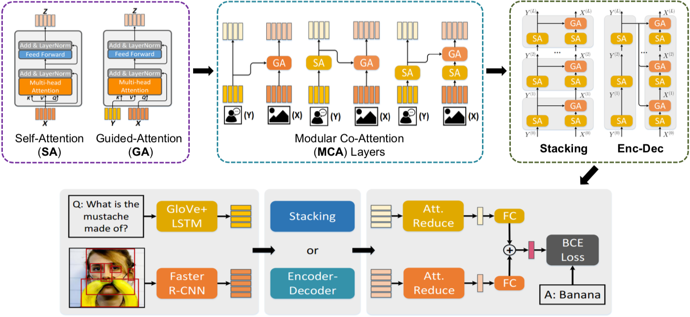

# Deep Modular Co-Attention Networks (MCAN)

This repository corresponds to the **PyTorch** implementation of the MCAN for VQA, which won the champion in [VQA Challgen 2019](https://visualqa.org/roe.html). With an ensemble of 27 models, we achieved an overall accuracy **75.23%** and **75.26%** on *test-std* and *test-challenge* splits, respectively. See our  [slides](https://drive.google.com/open?id=1geJTEVMMGs9Y3S2_pZxNzgPMccfYpM_r) for details.

By using the commonly used bottom-up-attention visual features, a single MCAN model delivers **70.70%** (small model) and **70.93%** (large model) overall accuracy on the *test-dev* split of *VQA-v2* dataset respectively, which significantly outperform existing state-of-the-arts. Please check our [paper](http://openaccess.thecvf.com/content_CVPR_2019/html/Yu_Deep_Modular_Co-Attention_Networks_for_Visual_Question_Answering_CVPR_2019_paper.html) for details.



## Updates

July 10, 2019

- **Pytorch implementation of MCAN along with several state-of-the-art models on VQA/GQA/CLEVR are maintained in our another [OpenVQA](https://github.com/MILVLG/openvqa) project.**

June 13, 2019
- Pure PyTorch implementation of MCAN model with deep encoder-decoder strategy. 
- Self-contained documentation from scratch .
- Model zoo consists of pre-trained MCAN-small and MCAN-large models on the VQA-v2 dataset.
- Multi-GPUs training and gradient accumulation.

## Table of Contents
0. [Prerequisites](#Prerequisites)
0. [Training](#Training)
0. [Validation and Testing](#Validation-and-Testing)
0. [Pretrained models](#Pretrained-models)
0. [Citation](#Citation)


## Prerequisites

#### Software and Hardware Requirements

You may need a machine with at least **1 GPU (>= 8GB)**, **20GB memory** and **50GB free disk space**.  We strongly recommend to use a SSD drive to guarantee high-speed I/O.

You should first install some necessary packages.

1. Install [Python](https://www.python.org/downloads/) >= 3.5
2. Install [Cuda](https://developer.nvidia.com/cuda-toolkit) >= 9.0 and [cuDNN](https://developer.nvidia.com/cudnn)
3. Install [PyTorch](http://pytorch.org/) >= 0.4.1 with CUDA (**Pytorch 1.x is also supported**).
4. Install [SpaCy](https://spacy.io/) and initialize the [GloVe](https://github.com/explosion/spacy-models/releases/download/en_vectors_web_lg-2.1.0/en_vectors_web_lg-2.1.0.tar.gz) as follows:

	```bash
	$ pip install -r requirements.txt
	$ wget https://github.com/explosion/spacy-models/releases/download/en_vectors_web_lg-2.1.0/en_vectors_web_lg-2.1.0.tar.gz -O en_vectors_web_lg-2.1.0.tar.gz
	$ pip install en_vectors_web_lg-2.1.0.tar.gz
	```


#### Setup 

 The image features are extracted using the [bottom-up-attention](https://github.com/peteanderson80/bottom-up-attention) strategy, with each image being represented as an dynamic number (from 10 to 100) of 2048-D features. We store the features for each image in a `.npz` file. You can prepare the visual features by yourself or download the extracted features from [OneDrive](https://awma1-my.sharepoint.com/:f:/g/personal/yuz_l0_tn/EsfBlbmK1QZFhCOFpr4c5HUBzUV0aH2h1McnPG1jWAxytQ?e=2BZl8O) or [BaiduYun](https://pan.baidu.com/s/1C7jIWgM3hFPv-YXJexItgw#list/path=%2F). The downloaded files contains three files: **train2014.tar.gz, val2014.tar.gz, and test2015.tar.gz**, corresponding to the features of the train/val/test images for *VQA-v2*, respectively. You should place them as follows:

```angular2html
|-- datasets
	|-- coco_extract
	|  |-- train2014.tar.gz
	|  |-- val2014.tar.gz
	|  |-- test2015.tar.gz
```

Besides, we use the VQA samples from the [visual genome dataset](http://visualgenome.org/) to expand the training samples. Similar to existing strategies, we preprocessed the samples by two rules:

1. Select the QA pairs with the corresponding images appear in the MSCOCO train and *val* splits.
2. Select the QA pairs with the answer appear in the processed answer list (occurs more than 8 times in whole *VQA-v2* answers).

For convenience, we provide our processed vg questions and annotations files, you can download them from [OneDrive](https://awma1-my.sharepoint.com/:f:/g/personal/yuz_l0_tn/EmVHVeGdck1IifPczGmXoaMBFiSvsegA6tf_PqxL3HXclw) or [BaiduYun](https://pan.baidu.com/s/1QCOtSxJGQA01DnhUg7FFtQ#list/path=%2F), and place them as follow:


```angular2html
|-- datasets
	|-- vqa
	|  |-- VG_questions.json
	|  |-- VG_annotations.json
```

After that, you can run the following script to setup all the needed configurations for the experiments

```bash
$ sh setup.sh
```

Running the script will: 

1. Download the QA files for [VQA-v2](https://visualqa.org/download.html).
2. Unzip the bottom-up features

Finally, the `datasets` folders will have the following structure:

```angular2html
|-- datasets
	|-- coco_extract
	|  |-- train2014
	|  |  |-- COCO_train2014_...jpg.npz
	|  |  |-- ...
	|  |-- val2014
	|  |  |-- COCO_val2014_...jpg.npz
	|  |  |-- ...
	|  |-- test2015
	|  |  |-- COCO_test2015_...jpg.npz
	|  |  |-- ...
	|-- vqa
	|  |-- v2_OpenEnded_mscoco_train2014_questions.json
	|  |-- v2_OpenEnded_mscoco_val2014_questions.json
	|  |-- v2_OpenEnded_mscoco_test2015_questions.json
	|  |-- v2_OpenEnded_mscoco_test-dev2015_questions.json
	|  |-- v2_mscoco_train2014_annotations.json
	|  |-- v2_mscoco_val2014_annotations.json
	|  |-- VG_questions.json
	|  |-- VG_annotations.json

```


## Training

The following script will start training with the default hyperparameters:

```bash
$ python3 run.py --RUN='train'
```
All checkpoint files will be saved to:

```
ckpts/ckpt_<VERSION>/epoch<EPOCH_NUMBER>.pkl
```

and the training log file will be placed at:

```
results/log/log_run_<VERSION>.txt
```

To add：

1. ```--VERSION=str```, e.g.```--VERSION='small_model'``` to assign a name for your this model.

2. ```--GPU=str```, e.g.```--GPU='2'``` to train the model on specified GPU device.

3. ```--NW=int```, e.g.```--NW=8``` to accelerate I/O speed.

4. ```--MODEL={'small', 'large'}```  ( Warning: The large model will consume more GPU memory, maybe [Multi-GPU Training and Gradient Accumulation](#Multi-GPU-Training-and-Gradient-Accumulation) can help if you want to train the model with limited GPU memory.)

5. ```--SPLIT={'train', 'train+val', 'train+val+vg'}``` can combine the training datasets as you want. The default training split is ```'train+val+vg'```.  Setting ```--SPLIT='train'```  will trigger the evaluation script to run the validation score after every epoch automatically.

6. ```--RESUME=True``` to start training with saved checkpoint parameters. In this stage, you should assign the checkpoint version```--CKPT_V=str``` and the resumed epoch number ```CKPT_E=int```.

7. ```--MAX_EPOCH=int``` to stop training at a specified epoch number.

8. ```--PRELOAD=True``` to pre-load all the image features into memory during the initialization stage (Warning: needs extra 25~30GB memory and 30min loading time from an HDD drive).


####  Multi-GPU Training and Gradient Accumulation

We recommend to use the GPU with at least 8 GB memory, but if you don't have such device, don't worry, we provide two ways to deal with it:

1. _Multi-GPU Training_: 

    If you want to accelerate training or train the model on a device with limited GPU memory, you can use more than one GPUs:

	Add ```--GPU='0, 1, 2, 3...'```

    The batch size on each GPU will be adjusted to `BATCH_SIZE`/#GPUs automatically.

2. _Gradient Accumulation_: 

    If you only have one GPU less than 8GB, an alternative strategy is provided to use the gradient accumulation during training:
	
	Add ```--ACCU=n```  
	
    This makes the optimizer accumulate gradients for`n` small batches and update the model weights at once. It is worth noting that  `BATCH_SIZE` must be divided by ```n``` to run this mode correctly. 


## Validation and Testing

**Warning**: If you train the model use ```--MODEL``` args or multi-gpu training, it should be also set in evaluation.


#### Offline Evaluation

Offline evaluation only support the VQA 2.0 *val* split. If you want to evaluate on the VQA 2.0 *test-dev* or *test-std* split, please see [Online Evaluation](#Online-Evaluation).

There are two ways to start:

(Recommend)

```bash
$ python3 run.py --RUN='val' --CKPT_V=str --CKPT_E=int
```

or use the absolute path instead:

```bash
$ python3 run.py --RUN='val' --CKPT_PATH=str
```


#### Online Evaluation

The evaluations of both the VQA 2.0 *test-dev* and *test-std* splits are run as follows:

```bash
$ python3 run.py --RUN='test' --CKPT_V=str --CKPT_E=int
```

Result files are stored in ```results/result_test/result_run_<'PATH+random number' or 'VERSION+EPOCH'>.json```

You can upload the obtained result json file to [Eval AI](https://evalai.cloudcv.org/web/challenges/challenge-page/163/overview) to evaluate the scores on *test-dev* and *test-std* splits.


## Pretrained models

We provide two pretrained models, namely the `small` model and the `large` model. The small model corrresponds to the one describe in our paper with slightly higher performance (the overall accuracy on the *test-dev* split is 70.63% in our paper) due to different pytorch versions. The large model uses a 2x larger `HIDDEN_SIZE=1024` compared to the small model with `HIDDEN_SIZE=512`. 

The performance of the two models on *test-dev* split is reported as follows:

_Model_ | Overall | Yes/No | Number | Other
:-: | :-: | :-: | :-: | :-:
_Small_ | 70.7 | 86.91 | **53.42** | 60.75| 
_Large_ | **70.93**| **87.39** | 52.78 | **60.98**|


These two models can be downloaded from [OneDrive](https://awma1-my.sharepoint.com/:f:/g/personal/yuz_l0_tn/EtNU5OG1dNhMq8M1pgeuQZwBgcj2RQCVnzLGDeDfnejPMQ?e=ynYhvk) or [BaiduYun](https://pan.baidu.com/s/1GW_SFErXSIBJ2Ojg2qaRmw#list/path=%2F), and you should unzip and put them to the correct folders as follows:

```angular2html
|-- ckpts
	|-- ckpt_small
	|  |-- epoch13.pkl
	|-- ckpt_large
	|  |-- epoch13.pkl

```

Set ```--CKPT={'small', 'large'} --CKPT_E=13``` to testing or resume training, details can be found in [Training](#Training) and [Validation and Testing](#Validation-and-Testing). 


## Citation

If this repository is helpful for your research, we'd really appreciate it if you could cite the following paper:

```
@inProceedings{yu2019mcan,
  author = {Yu, Zhou and Yu, Jun and Cui, Yuhao and Tao, Dacheng and Tian, Qi},
  title = {Deep Modular Co-Attention Networks for Visual Question Answering},
  booktitle = {Proceedings of the IEEE Conference on Computer Vision and Pattern Recognition (CVPR)},
  pages = {6281--6290},
  year = {2019}
}
```
